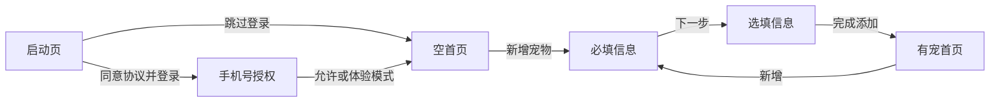

# Phase 1 MVP 产品与技术方案

## 范围

本阶段只交付启动页、手机号授权页、首页空状态、添加宠物页和首页有宠状态。预约、门店、积分、AI、健康记录、真实账号和后端均不在本阶段实现；首页入口仅用于还原信息架构，不提供跳转。

## 核心用户流程

隐私协议勾选是登录路径的前置条件。手机号按钮使用微信 `getPhoneNumber` 能力，但 MVP 无服务端交换手机号；拒绝或模拟器环境会进入不采集手机号的体验模式。宠物档案由 mock repository 写入微信本地存储，使空态和有宠态都能在开发期间验收。

## 架构决策

- **框架**：Taro 4、React 18、TypeScript strict，首个构建目标为微信小程序。
- **领域层**：`domain/` 定义稳定的宠物实体、草稿与校验，不引用页面或微信 API。
- **服务层**：`services/pet-repository.ts` 声明 repository 契约并提供本地 mock 实现；后续接 API 时替换实现，而非改写页面模型。
- **状态层**：`store/` 提供 React context 装配点；页面可在 `useDidShow` 时从 repository 刷新，以适应小程序页面栈生命周期。
- **平台层**：`adapters/` 预留登录、通知、媒体等微信能力适配，真实授权接入后不得把平台字段作为领域主键。
- **展示层**：`features/` 按业务切片组织页面，`components/` 放置共享状态栏和底部导航，`styles/` 管理全局令牌。
- **导航**：使用 Taro 原生页面路由。启动页是入口，添加成功使用 redirect 返回首页，避免重复表单留在页面栈。

## 数据边界

当前唯一持久化数据是 `Pet[]`，存储键为 `ai-pet-manager:pets`。手机号、授权凭证、健康数据和 AI 对话均不会被采集。Mock 数据层仅用于体验验证，不视为生产数据方案。

## 测试策略

- 领域单元测试覆盖必填校验和实体创建。
- `tsc --noEmit` 验证严格类型边界。
- Taro production build 验证微信端编译链路。
- 微信开发者工具中人工走查协议未勾选、跳过登录、授权拒绝、必填错误、完整建档、应用重启后有宠状态。

## 后续演进

真实手机号登录必须增加后端 code 交换、会话管理、隐私说明和失败恢复。后端 repository 应实现相同契约，并补充同步、幂等与冲突规则。AI、健康及预约能力需单独评审后再增加，不能复用 mock 授权作为生产身份。
